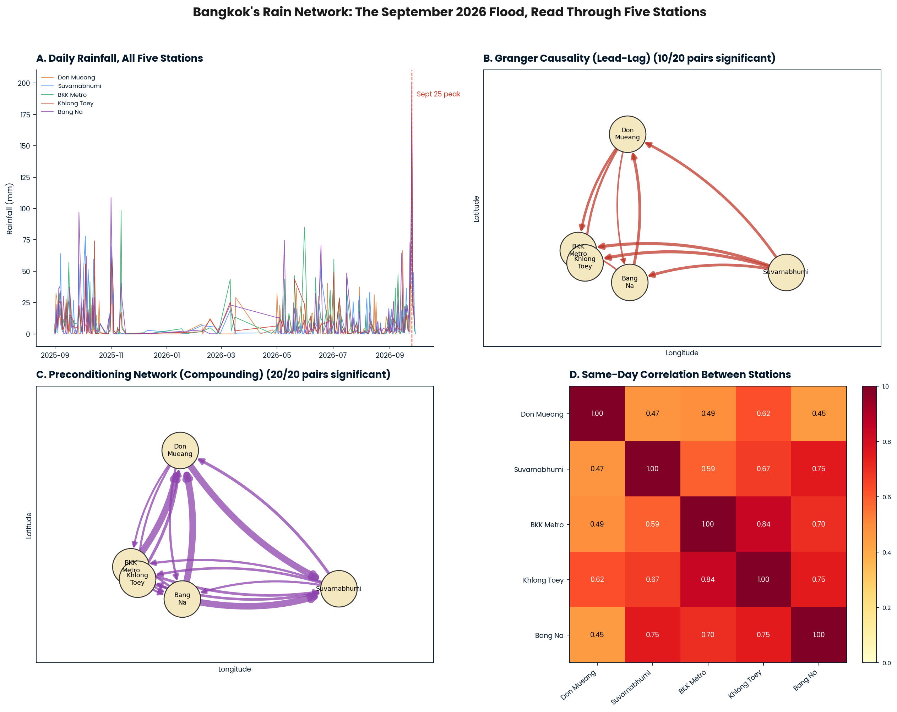

# A network-science analysis of the September 2026 Bangkok floods**




## About

Five real rain gauges across Bangkok, one flood, three network-science questions. Did the September 2026
rainfall carry a spatial direction, did stations synchronize on their worst days, and was the city already
primed before the heaviest rain arrived? This repository answers all three with Granger causality, event
synchronization, and an antecedent-precipitation preconditioning network, applied to a validated,
bug-checked five-station daily rainfall record spanning August 2025 through September 2026.

**North Star Question:** Does the rainfall behind Bangkok's September 2026 flood show a genuine network
signature, or is it better described as five stations independently recording the same undifferentiated
storm?

**Short answer:** No, it isn't undifferentiated. The rain had a direction (Suvarnabhumi Airport and Bang
Na Agromet, both southeast of the city center, consistently led the other stations), the city's stations
mostly synchronized on their extreme days (7 of 10 pairs, Don Mueang the one consistent outlier), and
every station's antecedent wetness predicted every other station's peaks (20 of 20 directed pairs
significant), evidence of a shared regional wet regime that primed the whole city before the storm's
directional signature tipped it into flood.

## Repository Structure

```
bangkok-2026-rain-network.ipynb   <- the single notebook: everything lives here
README.md                          <- this file
figures/                           <- output plots (regenerated by the notebook)
  graphical_abstract.png
  eda_timeseries.png
  eda_distributions.png
  preconditioning_network.png
  granger_network.png
```


## Data

All rainfall figures originate from [OGIMET's decoded synoptic report archive](https://www.ogimet.com/cgi-bin/gsynres),
a public archive of the same SYNOP weather reports Thailand's Meteorological Department transmits
internationally under WMO code standards. Only genuine 00:00 UTC ("midnight") observations are used, each
representing one true calendar-day rainfall total.


| Station | WMO ID | Area |
|---|---|---|
| Don Mueang | 48456 | North suburb, old domestic airport |
| Suvarnabhumi Airport | 48429 | East Bangkok, main international airport |
| Bangkok Metropolis | 48455 | Central Bangkok |
| Khlong Toey | 48454 | Central-south, port area |
| Bang Na Agromet | 48453 | Southeast Bangkok |

## Methods

- **Granger causality** (manual OLS F-test, lag 1) for directional lead-lag structure between stations.
- **Event synchronization** (permutation-tested, ±1-day window, 90th-percentile peak days) for undirected
  simultaneity.
- **Antecedent Precipitation Index (API)** preconditioning network (decay constant k = 0.85,
  permutation-tested) for cross-station compounding.

Full equations, citations, and statistical caveats (alpha = 0.10, no multiple-comparisons correction, why
each method was chosen) are in the notebook's Methodology section.

## Known Limitations

Single lag tested for Granger; uneven per-station sample sizes (125-196 real days); event synchronization
results are sensitive to the chosen window and quantile; this is one event, not a comparison against an
ordinary month or against 2011; no drainage, subsidence, or river-level data is included. Full detail in
the notebook's Known Limitations section.

## Future Work

Multi-lag Granger, a replicated 2011 analysis for direct comparison, sensitivity checks on the event
synchronization thresholds, a test of a single city-wide antecedent index against the per-station
preconditioning network, and a parallel Manila comparison. Full detail in the notebook.

## License

MIT. Data belongs to OGIMET / Thailand Meteorological Department; this repository only redistributes a
derived, parsed subset for reproducibility.

Questions? Send them over at jprmaulion[at]gmail[com]. *Salamat po!*
